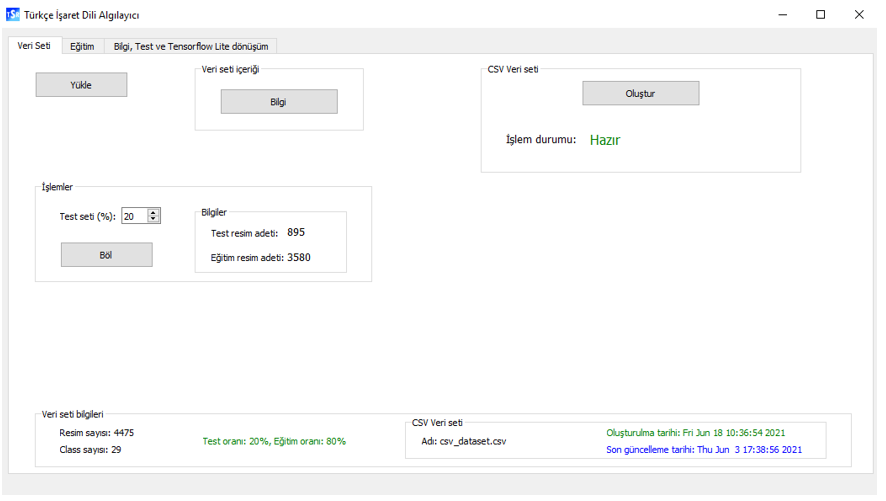
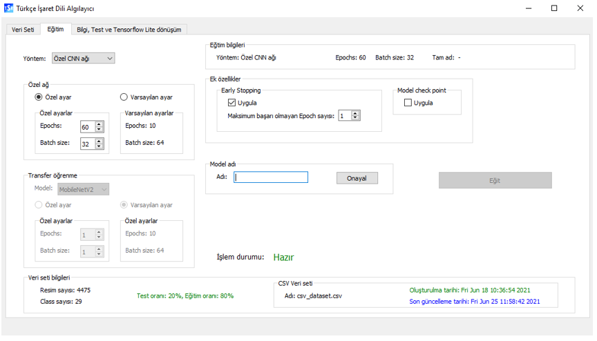
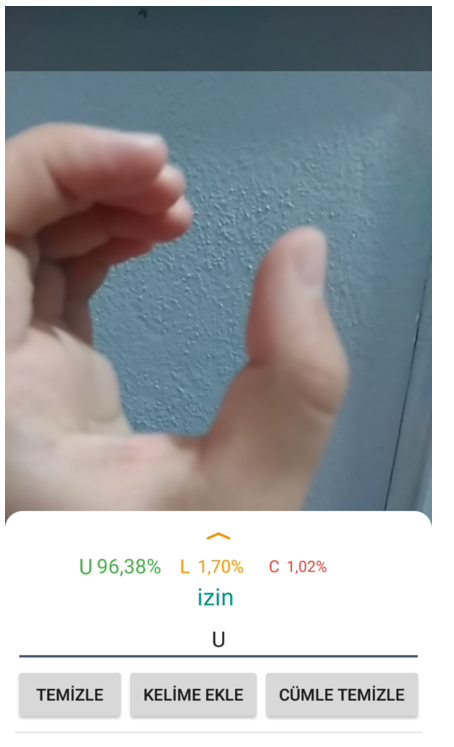
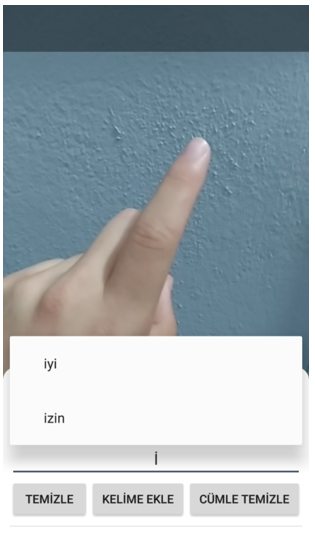
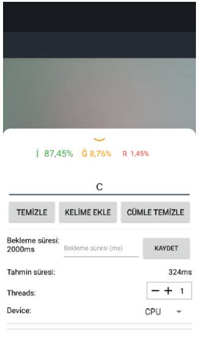

# Turkish Sign Language Characters Recognition

CNN Model training with desktop GUI for recognition turkish sign language characters and using trained model with mobile app.

## Used Tools
- TensorFlow, TensorFlowLite, TensorBoard
- PyQt5
- NumPy
- OpenCV
- Matplotlib
- seaborn
 
 ## Run Project
```
python isaredilialgila.py
```
 
 ## Features
- Dataset of approximately 4500 images.
- GUI for model training and testing.
- Custom model training.
- Transfer learning with MobileNetV2, ResNet50, InceptionV3.
- Model using with android app.
- Multiple  model storeing.
- Model visualization with TensorBoard.
- Real time model testing with OpenCV.
- Model transformation for use with TensorFlowLite.
 
## Screenshots
 ### Desktop App
<p align="center">
  
  
</p>
 
### Mobile App (Android)
 <p align="center">
  
  
   
</p>
 
 > For more details: [Details](./report.pdf)
 
## License
MIT

